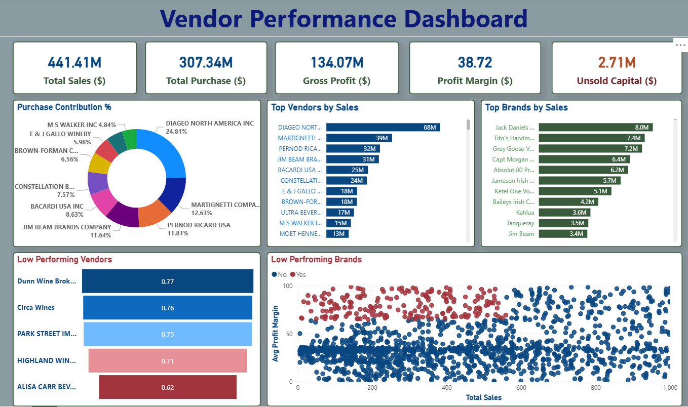

# Vendor Performance Analysis- Retail Inventory & Sales

## Summary
A data-driven vendor performance analysis project that identifies top and underperforming vendors and brands using Python, SQL, and an interactive Power BI dashboard to optimize profitability and inventory management.

---

## Overview
Effective vendor and inventory management are critical for maximizing profitability in retail and wholesale businesses. This project analyzes vendor-level and brand-level sales, purchase, and profitability data to uncover performance gaps, dependency risks, and inventory inefficiencies.

The analysis combines exploratory data analysis (EDA), statistical insights, and an interactive Power BI dashboard to support data-driven decision-making for pricing, promotions, vendor diversification, and stock optimization.

---

## Problem Statement
Businesses often face challenges such as:
- Over-reliance on a small number of vendors  
- Slow-moving or unsold inventory blocking working capital  
- Poor visibility into vendor profitability and margins  
- Inefficient pricing and bulk purchasing strategies  

This project aims to:
- Identify top and low-performing vendors and brands
- Analyze gross profit, profit margins, and inventory turnover
- Detect unsold inventory risks
- Support pricing, promotion, and procurement optimization

---

## Dataset
The dataset contains transactional and vendor-level information including:
- begin_inventory.csv
- end_inventory.csv
- purchase_prices.csv
- purchases.csv
- sales.csv
- vendor_invoice.csv

To improve data reliability, the following records were removed:
- Gross Profit <= 0
- Profit Margin <= 0
- Total Sales Quantity = 0

---

## Tools and Technologies
- Python (Pandas, NumPy, Matplotlib, Seaborn, SciPy)
- SQL (MySQL)
- SQLAlchemy and PyMySQL (Database connectivity)
- Jupyter Notebook
- Power BI (Interactive dashboards)
- Microsoft Word (Business report documentation)

---

## Methods
- Data cleaning and preprocessing
- Exploratory Data Analysis (EDA)
- Correlation analysis
- Inventory turnover analysis
- Vendor and brand performance segmentation
- Statistical comparison of profit margins
- Interactive dashboard development in Power BI

---

## Key Insights
- Top 10 vendors contribute approximately 65.7% of total purchases, indicating vendor dependency risk.
- Total unsold inventory capital amounts to $2.71M, impacting cash flow and storage costs.
- Bulk purchasing results in nearly 72% lower unit costs.
- Low-performing vendors often maintain higher profit margins but lower sales volumes.
- Statistical hypothesis testing confirms significant differences in profit margins between top and low-performing vendors.

---

## Dashboard
The Vendor Performance Dashboard provides:
- Key KPIs including Total Sales, Total Purchases, Gross Profit, Profit Margin, and Unsold Capital
- Purchase contribution by vendor
- Top vendors and brands by sales
- Identification of low-performing vendors and brands
- Sales versus profit margin distribution analysis

A dashboard screenshot is included in the repository for reference.


---
## How to Run This Project
1. Clone the repository:
```bash
git clone https://github.com/your-usernamevendor-performance-analysis.git
```
2. Load the CSVs and ingest into the database:
```bash
python scripts/ingestion_db.py
```
3. Create vendor summary table:
```bash
python scripts/get_vendor_summary.py
```
4. Open and run notebooks:
   - `notebook/vendor_EDA.ipynb`
   - `notebook/vendor_performance_analysis.ipynb`
5. Open Power BI Dashboard:
   - `dashboard/vendor_performancce_dashboard.pbix`

---
## Results and Conclusion

This project provides a comprehensive evaluation of vendor and brand performance by combining statistical analysis with interactive visual reporting. The findings enable stakeholders to identify revenue-driving vendors, detect inefficiencies, reduce inventory risk, and optimize pricing and procurement strategies.

